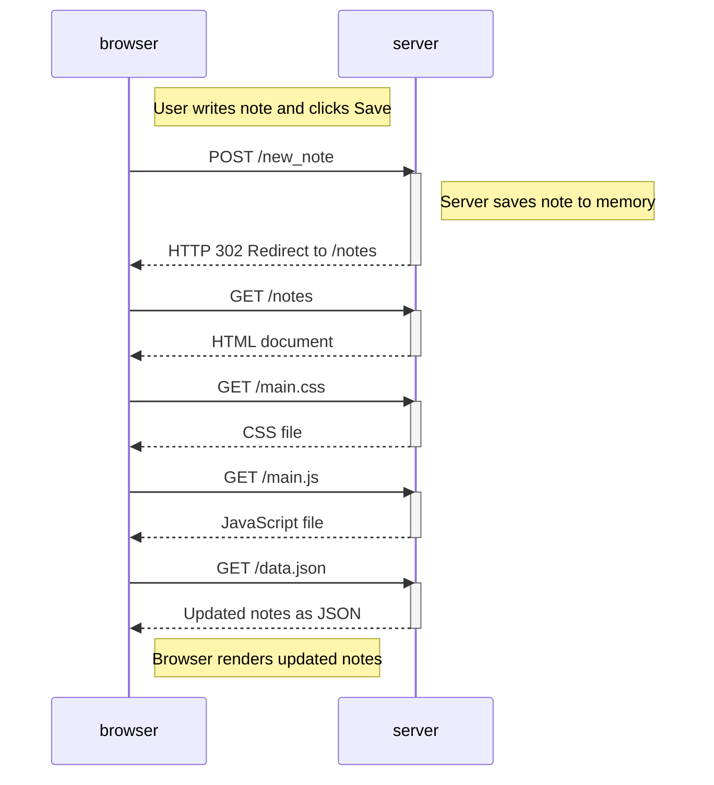

```mermaid
sequenceDiagram
    participant browser
    participant server

    Note right of browser: User writes note and clicks Save

    browser->>server: POST /new_note
    activate server
    Note right of server: Server saves note to memory
    server-->>browser: HTTP 302 Redirect to /notes
    deactivate server

    browser->>server: GET /notes
    activate server
    server-->>browser: HTML document
    deactivate server

    browser->>server: GET /main.css
    activate server
    server-->>browser: CSS file
    deactivate server

    browser->>server: GET /main.js
    activate server
    server-->>browser: JavaScript file
    deactivate server

    browser->>server: GET /data.json
    activate server
    server-->>browser: Updated notes as JSON
    deactivate server

    Note right of browser: Browser renders updated notes
```